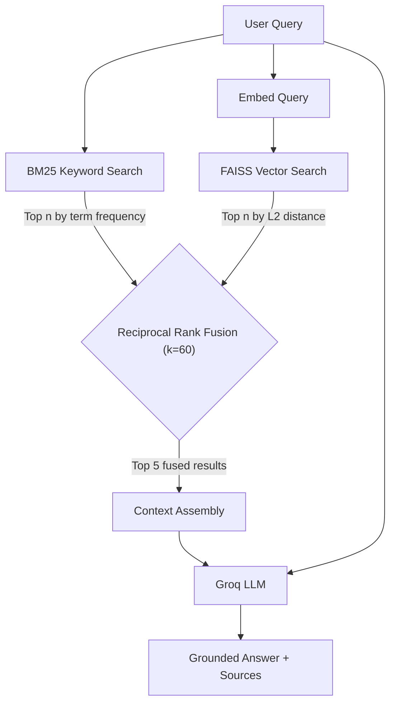
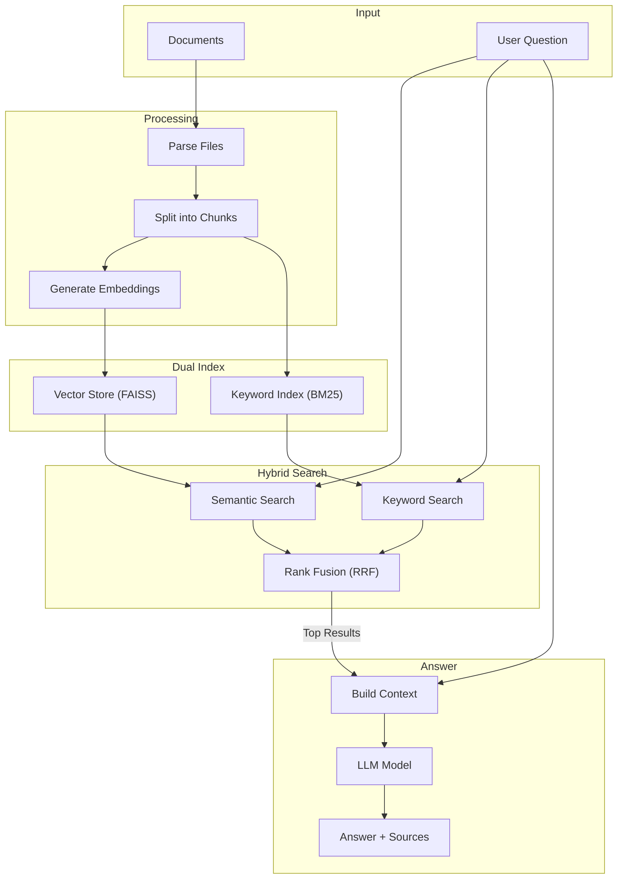

<div align="center">

# ⚡ SparkPlug

### **The Hybrid-Retrieval RAG Chatbot**

**Advanced Retrieval-Augmented Generation with Dual-Index Fusion & Grounded LLM Answers**

**Powered by FAISS | BM25 | Groq | SentenceTransformers | Streamlit**

[](https://python.org)
[](https://streamlit.io)
[](https://github.com/facebookresearch/faiss)
[](https://groq.com)
[](https://langchain.com)

---

**A production-ready RAG pipeline with hybrid BM25 + FAISS retrieval, Reciprocal Rank Fusion, and a non-blocking Streamlit UI.**

[Features](#-features) • [Architecture](#-architecture) • [Quick Start](#-quick-start) • [Performance](#-performance-stats) • [Configuration](#-configuration)

</div>

---

## 📋 Table of Contents

- [Overview](#-overview)
- [Features](#-features)
- [Architecture](#-architecture)
- [Project Structure](#-project-structure)
- [Quick Start](#-quick-start)
- [Performance Stats](#-performance-stats)
- [Configuration](#-configuration)
- [Troubleshooting](#-troubleshooting)

---

## 🎯 Overview

SparkPlug is a **Retrieval-Augmented Generation (RAG)** chatbot that lets you upload documents and ask questions in natural language. It runs two parallel search engines — one for exact keywords, one for semantic meaning — fuses their results with a mathematical ranking algorithm, and feeds the best context to a 70-billion parameter LLM for grounded answer generation.

### What Makes It Special?

| Feature | Description |
| :--- | :--- |
| 🔍 **Dual-Index Hybrid Search** | Parallel BM25 keyword + FAISS vector search for maximum recall |
| 🔄 **Reciprocal Rank Fusion** | RRF algorithm (`k=60`) merges similarity search & BM25 Keyword search return Top Results |
| 📄 **6-Format File Ingestion** | Natively parses PDF, Word, Excel, CSV, JSON, and plain text files |
| 🛡️ **Non-Breakable UI** | Streamlit interface loads instantly; errors are caught and displayed, never crash the app |
| 📚 **Source Citations** | Every answer includes expandable references with source file, page number, and context |

---

## ✨ Features

### 🔍 Hybrid Retrieval Engine

SparkPlug doesn't rely on a single search strategy. It runs two fundamentally different retrieval approaches in parallel, then fuses them:



### Why Two Search Engines?

| Search Type | What It Finds | What It Misses |
| :--- | :--- | :--- |
| **BM25 Only** | Exact names, IDs, codes, acronyms | Paraphrased content, synonyms | 
| **FAISS Only** | Semantically similar content, rephrased concepts | Rare terms, proper nouns | 
| **Hybrid (RRF)** | Both exact matches AND semantic matches | Almost nothing — covers both failure modes | 
### 📄 Multi-Format Document Ingestion

The ingestion engine automatically detects file types and routes them to specialized parsers:

| File Format | Parser Used | What It Extracts |
| :--- | :--- | :--- |
| `.pdf` | `PyPDFLoader` | Page-by-page text with page numbers |
| `.docx` | `Docx2txtLoader` | Full document text content |
| `.csv` | `CSVLoader` | Row-by-row structured data |
| `.xlsx` | `UnstructuredExcelLoader` | Spreadsheet cell contents |
| `.json` | `JSONLoader` | Nested JSON field values |
| `.txt` | `TextLoader` | Raw plain text |


### 🛡️ Grounded Generation (No Hallucination)

The LLM operates under strict system-level constraints:

```
✅ Read all relevant context before answering
✅ Combine information from multiple passages
✅ Explain conflicting information instead of guessing
✅ Reply "Information not found" if context is insufficient
❌ No outside knowledge or assumptions
❌ Do not mention the retrieval process
```

---

## 🏗️ Architecture

### System Flow



### Tech Stack

| Layer | Technology | Purpose |
| :--- | :--- | :--- |
| **UI Framework** | Streamlit 1.58+ | Reactive web interface with chat, file upload, session state |
| **Vector Index** | FAISS (faiss-cpu) | Flat L2 brute-force similarity search over vectors |
| **Keyword Index** | BM25 (rank-bm25) | Okapi BM25 term-frequency scoring for sparse retrieval |
| **Embeddings** | SentenceTransformers  | Local CPU inference, dimensional dense vectors |
| **LLM** | Groq API  | Ultra-fast inference (~300 tok/sec), Large context window |
| **Document Parsing** | LangChain Community Loaders | PDF, Word, Excel, CSV, JSON, Text file extraction |
| **Text Splitting** | LangChain Text Splitters | Recursive character splitting with overlap |
| **Prompt Engine** | LangChain Core (PromptTemplate) | Structured prompt assembly with input variables |
| **Serialization** | Python pickle + FAISS native | Disk persistence for indexes and document metadata |
| **Logging** | Rich Console | Color-coded terminal output for pipeline debugging |
| **Config** | python-dotenv | Secure API key loading from `.env` files |

---

## 📁 Project Structure

```
SparkPlug/
├── .env                          # API key (GORQ_API)
├── .env.example                  # Template
├── requirments.txt               # Dependencies
├── pyproject.toml                # UV package config
├── main.py                       # Streamlit UI + Pipeline Orchestrator
├── README.md                     # This file
├── LICENSE                       # MIT License
│
├── src/                          # Core RAG engine
│   ├── config.py                 # All settings & hyperparameters
│   ├── data_loader.py            # Multi-format document parser
│   ├── chunks.py                 # Recursive text splitter
│   ├── embeddings.py             # SentenceTransformer encoder
│   ├── basestore.py              # FAISS + BM25 index builders
│   ├── hybridretriever.py        # RRF fusion retriever
│   ├── llm.py                    # Groq LLM interface
│   └── logger.py                 # Rich console logger
│
├── rootdata/
│   └── temp_upload/              # User document storage
│
└── vectorstore/                  # Persisted indexes
    ├── faiss.index               # FAISS vector index
    ├── documents.pkl             # Serialized chunk metadata
    └── bm25.pkl                  # Serialized BM25 index
```

---

## 🚀 Quick Start

### 1. Installation

```bash
# Clone the repository
git clone https://github.com/krishna-notfound/sparkplug-rag.git
cd sparkplug-rag

# Install dependencies
pip install -r requirments.txt

# Configure API key
cp .env.example .env
# Edit .env with your Groq API key
```

### 2. Add Documents

```bash
# Option A: Drop files directly
# Place PDF/CSV/DOCX/TXT/XLSX/JSON files into rootdata/temp_upload/

# Option B: Use the web UI uploader (sidebar)
```

### 3. Launch

```bash
streamlit run main.py
```

Open [http://localhost:8501](http://localhost:8501) and start asking questions.

---

## 📊 Performance Stats

### Pipeline Latency Breakdown

```
+--------------------------------------------------------------+
|                     LATENCY BREAKDOWN                        |
+--------------------------------------------------------------+
|                                                              |
|  Document Parsing      ████░░░░░░░░░░░░░  0.5s   (10%)     |
|  Chunk Generation      ██░░░░░░░░░░░░░░░  0.2s    (4%)     |
|  Embedding Encode      ████████████░░░░░  2.5s   (50%)     |
|  FAISS Index Build     █░░░░░░░░░░░░░░░░  0.1s    (2%)     |
|  BM25 Index Build      █░░░░░░░░░░░░░░░░  0.1s    (2%)     |
|  ─── Indexing Total ── ████████████████░  3.4s   (68%)     |
|                                                              |
|  BM25 Search           █░░░░░░░░░░░░░░░░  0.05s   (1%)     |
|  FAISS Search          █░░░░░░░░░░░░░░░░  0.05s   (1%)     |
|  RRF Fusion            █░░░░░░░░░░░░░░░░  0.01s  (<1%)     |
|  LLM Generation        ████████░░░░░░░░░  1.5s   (30%)     |
|  ─── Query Total ───── █████████░░░░░░░░  1.6s   (32%)     |
|                                                              |
+--------------------------------------------------------------+
|  First Load: ~5s  |  Per Query: ~1.6s  |  Cost: $0/query*  |
+--------------------------------------------------------------+
|  * Groq free tier: 30 req/min, 14.4K tokens/min             |
+--------------------------------------------------------------+
```

### Benchmarks (50 Documents, ~5000 Chunks)

| Metric | Value | Notes |
| :--- | :---: | :--- |
| **Index Build Time** | ~5 seconds | One-time, cached via `st.cache_resource` |
| **Query Latency** | 1–2 seconds | End-to-end including LLM response |
| **Embedding Speed** | ~2,000 chunks/min | CPU-only with `all-MiniLM-L6-v2` |
| **FAISS Search** | < 50ms | Flat L2 brute-force over 5K vectors |
| **BM25 Search** | < 50ms | In-memory tokenized scoring |
| **RRF Fusion** | < 10ms | Pure Python dict-based scoring |
| **LLM Throughput** | ~300 tok/sec | Groq inference hardware |

### Capacity Scaling

| Scale | Documents | Chunks | RAM | Build Time |
| :--- | :---: | :---: | :---: | :---: |
| 🟢 **Small** (sweet spot) | 1–50 | ≤ 5K | ~200 MB | < 1 min |
| 🟡 **Medium** | 50–150 | ≤ 15K | ~500 MB | 1–5 min |
| 🟠 **Large** | 150–500 | ≤ 50K | ~2 GB | 5–30 min |
| 🔴 **Maximum** | 500–1000 | ≤ 100K | ~4 GB | 15–45 min |

### Cost Analysis

| Component | Cost | Notes |
| :--- | :--- | :--- |
| **Embeddings** | $0.00 | Local CPU inference, no API calls |
| **FAISS + BM25** | $0.00 | In-memory, no cloud services |
| **Groq LLM (Free)** | $0.00 | 30 req/min, 14.4K tok/min on free tier |
| **Groq LLM (Paid)** | ~$0.0003/query | ~$0.30 per 1000 queries |
| **Total (Free Tier)** | **$0.00** | Fully local except LLM inference |

---

## ⚙️ Configuration

### Environment Variables (`.env`)

```env
GORQ_API=gsk_your_groq_api_key_here
```

### Hyperparameters (`src/config.py`)

| Option | Default | Description |
| :--- | :---: | :--- |
| `EMBEDDINGS_MODEL` | `all-MiniLM-L6-v2` | SentenceTransformer model for encoding |
| `CHUNK_SIZE` | `1000` | Characters per text chunk |
| `CHUNK_OVERLAP` | `200` | Overlap between adjacent chunks |
| `TOP_RESULT` | `10` | Candidates retrieved per index (BM25 & FAISS each) |
| `FINAL_RESULT_RRF` | `5` | Final context chunks after RRF fusion |
| `LLM_MODEL_NAME` | `llama-3.3-70b-versatile` | Groq-hosted LLM model |
| `TEMPERATURE` | `0.8` | LLM creativity (0.0 = deterministic, 1.0 = creative) |
| `PRESIST_DIR` | `vectorstore` | Directory for persisted indexes |
| `DOC_PATH` | `temp_upload` | Upload subdirectory under `rootdata/` |

### RRF Fusion Formula

$$\mathrm{RRF{\_}score}(d) = \sum_{r \in \{BM25,\ FAISS\}} \frac{1}{k + \mathrm{rank}_r(d) + 1} \quad \text{where } k = 60$$

---

## 🔧 Troubleshooting

| Issue | Cause | Solution |
| :--- | :--- | :--- |
| `ModuleNotFoundError` | Dependencies not installed | `pip install -r requirments.txt` |
| `AuthenticationError` from Groq | Invalid `GORQ_API` key | Regenerate at [console.groq.com](https://console.groq.com), update `.env` |
| First launch takes 2–3 min | SentenceTransformer model downloading (~80MB) | One-time; cached in `~/.cache/huggingface/` afterwards |
| `Pipeline Failed` error in sidebar | Empty upload folder or corrupt files | Ensure `rootdata/temp_upload/` has valid documents |
| Slow indexing on large datasets | CPU-bound embedding computation | Reduce `CHUNK_SIZE` or split large files |
| `faiss.index` missing | Indexes not yet built | Upload documents, pipeline builds automatically |

---

## 📚 References

- [FAISS Documentation](https://faiss.ai)
- [SentenceTransformers Documentation](https://sbert.net)
- [LangChain Documentation](https://docs.langchain.com)
- [Groq API Reference](https://console.groq.com/docs)
- [BM25 Algorithm (Okapi)](https://en.wikipedia.org/wiki/Okapi_BM25)
- [Reciprocal Rank Fusion Paper](https://plg.uwaterloo.ca/~gvcormac/cormacksigir09-rrf.pdf)

---

## 📄 License

MIT License — see [LICENSE](LICENSE) for details.

---

<div align="center">